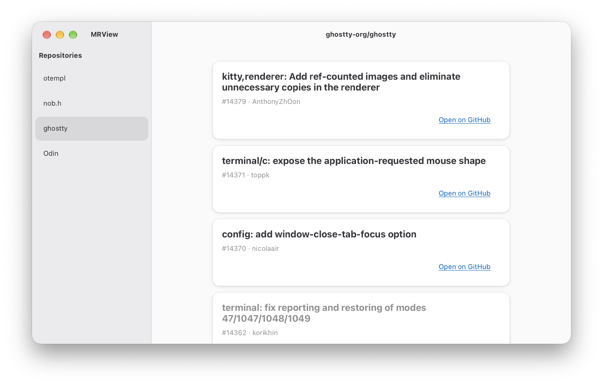

```
 _______ ______ ___ ___ __                 
|   |   |   __ \   |   |__|.-----.--.--.--.
|       |      <   |   |  ||  -__|  |  |  |
|__|_|__|___|__|\_____/|__||_____|________|
```



```
A simple libadwaita app for viewing PRs across GitHub repositories. List one
owner/repo per line in ~/.config/mrview/config, then select a repository in the
sidebar.

The config is just a text file. You'll need to make the ~/.config/mrview
directory and the config file yourself. Something like this:

    myname/myrepo
    someoneelse/anotherrepo

Blank lines are ignored, but there's no syntax for comments, and I don't trim
spaces from the lines. Each entry should be exactly owner/repo. I read the file
when the app starts, so restart it after changing the list. There's room for up
to 256 repositories in a 64KB config file. If the file is missing or can't be
read, the app prints an error to stderr and shows no repositories.

A lot of redundant code in this project now, like slices.c, arena.c, files.c
that are just not used. That comes automatically from my project generator
otempl. I'll delete them at some point, once I'm sure I'll not be needing them.

I let libadwaita/gtk4 do it's own thing for memory management, but the model is
completely statically allocated via .bss with explicit limits set, hopefully
fairly reasonable limits. The PR arenas share a 16MB storage pool.
```
